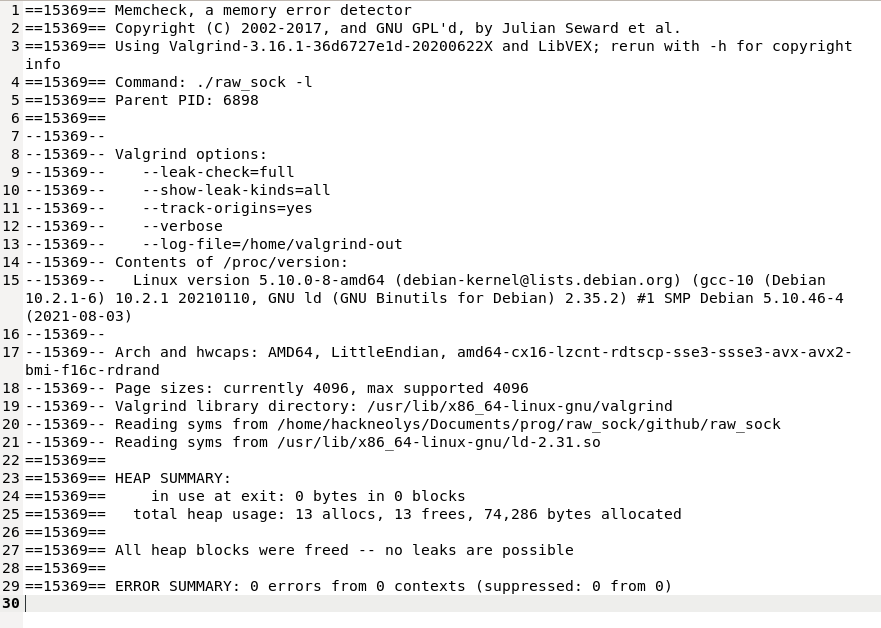

# Datalink layer sniffer for Linux

+ **LAST UPDATE : NTP, SMB/Mailslot/Browser, the obscure one Canon BJNP and 802.3 frames with LLC**

NEW RELEASE WITH BLUETOOTH IMPLEMENTATION - WORK IN PROGRESS

**/!\ <ins>THE MODULE ENGINE FOR BLUETOOTH</ins> IS DEVELOPPED IN THE EXPERIMENTAL BRANCH. NO REAL BUG CHECKS, JUST THINKING ABOUT NEW APPROACHS AND CONCEPTS/!\ !**

DO NOT HESITATE TO LEAVE YOUR FEEDBACK TO LET ME DO SOME IMPROVEMENTS OR BY A PAYPAL DONATION FOR THE SUPPORT

# Support Donation

 

# News

**New release working with libpcap. The older one dealt with raw sockets only**

**Linux libpcap datalink layer sniffer being able to sniff all TCP, IP, ICMP, ARP, IGMP and some frames from OSI Layer 2/3.**

Right now, it can manage **Ethernet, 802.1x and Linux SLL datalink frames (more to come)**

It works also as a string extractor, displaying in output file revelant strings

It grabs all revelant strings from packets : url, domain names, json requests etc...

Firstable, make sure you have libpcap installed on your system :

`sudo apt-get install libpcap-dev` 

You can see an example in file named string_log in the results repository

It binds to a network interface or grab all frames with -g option, binding to any device.

**Also being able to sniff some layer 2/3 packets like ARP, HOMEPLUG, HOMEPLUG POWERLINE, ETHERTYPE IEEE 1905 1a and other ones.**

**Need to be root to run the program**

Some functions are defined but non implemented but it's easy to do it (example : fake malloc)

+ <ins>Build commands :</ins>

`sudo git clone https://github.com/OzzyProjects/raw_socket_sniffer.git`

`cd /raw_socket_sniffer`

`sudo make`

+ <ins>Use (in root only) :</ins>

`./raw_sock -i [interface name] -r [output_string_file]`

or to sniff all frames (device any) : option -g

`./raw_sock -r [output_string_file] -g`

Exemple of one among others command line :

`./raw_sock -i wlp4s0 -r strings_log -f "not ipx" -t 1024 -m`

command line with option : binding to one device, recording strings to file, applying filters to the capture and setting timeout 

and monitor mode enabled (option -m)

The -r *output_string_file* is optional. Without it, the file created will be named **strings_record**

**You can add a bpf filter easily with -f [filter] option**

**The -c [max_packets] allows you to sniff a liminted number of frames**

Without interface provided, it sniffs from the first one available on the system

**And to get the list of network interfaces available, just do -l option**

**You can also define yourself a personnalised timeout with the -f [timeout in seconds] option. By default it's 0 (non blocking mode)**

You can see an example of output log in file named "example" in logs repository.

It works on Debian Buster/Bullseye and Ubuntu 20.04+.

I haven't checked yet for other versions or distros.

You can also check the complete valgrind memcheck report. No memory leaks or other memory problems.

**TODO : accept bpf filters files or propose some of them by default and capturing radiotap packets and other layers 2 protos **
